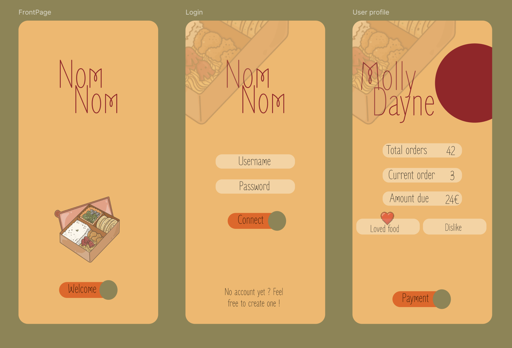
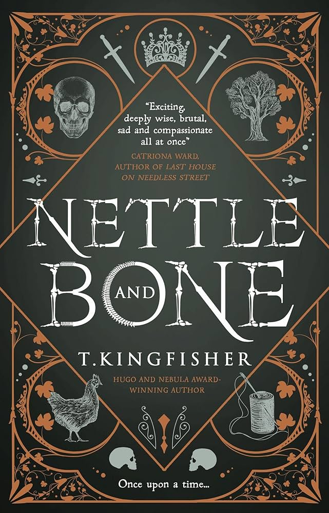
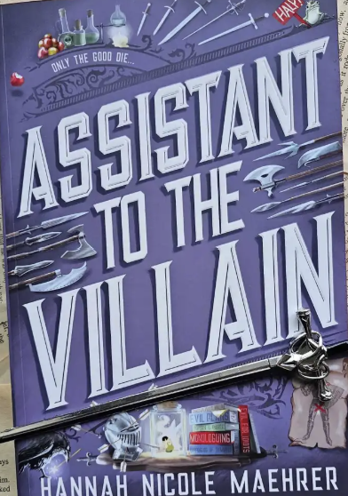
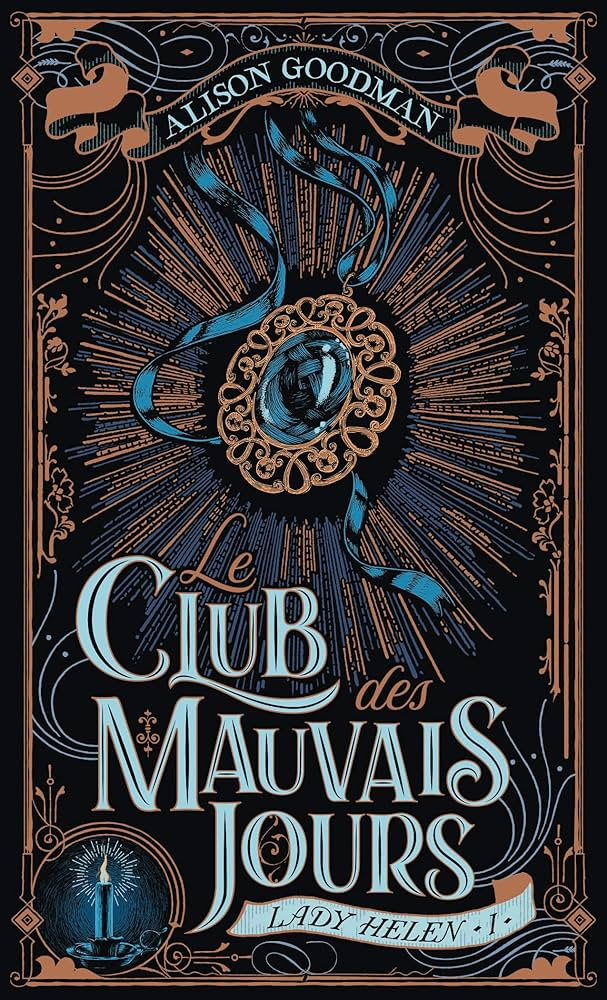
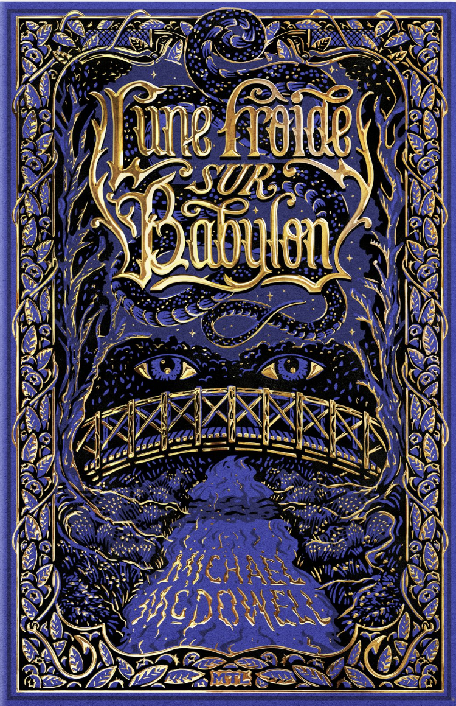

  

Ancienne technicienne télécom devenue développeuse web en reconversion via l'école Holberton.  

J’ai quitté un poste stable pour apprendre un métier que je trouve à la fois exigeant, créatif, et profondément utile

Avant de plonger dans ce monde, j’étais au service technique de Free. J’y ai appris l’écoute et la persévérance. Mais surtout, j’y ai compris que ce qui m’anime, c’est la résolution de problèmes avec une forte dose de créativité.

Aujourd’hui, je développe mes compétences, tout en continuant de cultiver ma sensibilité pour le design et surtout, l’expérience utilisateur.

J’aime aussi imprimer en 3D, courir des semi-marathons, faire des shootings photo 
et organiser des murder parties 🕵️‍♀️

---

  
  
  
  
  

### 
🧠 Frameworks & Librairies

  
  

### 
🗄️ Bases de données

  
  

### 
🎨 Design & UI

  
  

### 
🛠️ Outils & Environnement

  

---

### 
📚 En cours d'apprentissage

  

---

## 
🛠️ Projets Perso

🍱 <strong>NomNom</strong> : une app de gestion de livraison de gamelles maison, avec QR code et authentification Flask.

  

---

## 
🛠️ Projets Holberton

<strong>HBNB</strong> : réalisation en binome d'un clone d'airbnb. Ce projet a été très stimulant, et m'a fait apprendre la gestion de base de données, continuer de me perfectionner en python et une petite partie front.

<strong>Simple shell</strong> : projet à la base en binome, que j'ai dû réaliser seule, mon binome ayant quitté l'aventure en cours de route. Cela m'a vraiment montré la réalité d'un projet concret : une deadline à tenir malgré les aléas, et tout faire de A à Z toute seule.

<strong>PrintF</strong> : tout premier projet à la fin de mon premier trimestre. Nous avons dû recoder la fonction printf en C, hyper chouette pour bien comprendre comment tout fonctionne, et pas juste appliquer bêtement une logique apprise.

---

## 
📚 Mes lectures de 2025

  
  
  
  

---

## 
🔗 Me suivre ailleurs

  🌐 Portfolio en cours de construction  
   
  💼 <a href="https://www.linkedin.com/in/cl-perez/">LinkedIn</a> • 💌 <a href="mailto:cl.w.perez@gmail.com">Email</a>

  <a href="https://www.instagram.com/wilhelminah/">
     @wilhelminah
  </a>

  <a href="https://www.flickr.com/photos/wilhelminah">
    
    Mon book photo sur Flickr
  </a>

---

<em>“Be the developer your teenage self would have been proud of.”</em>

